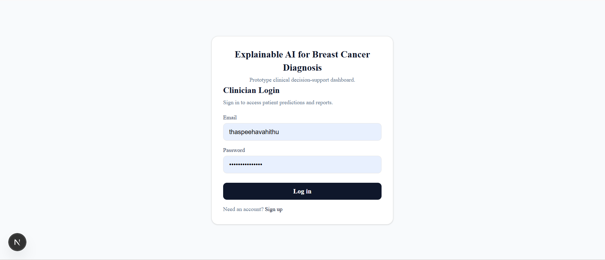
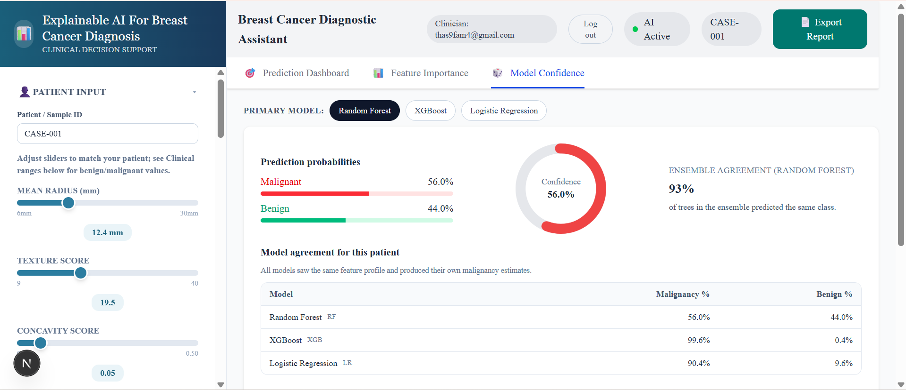
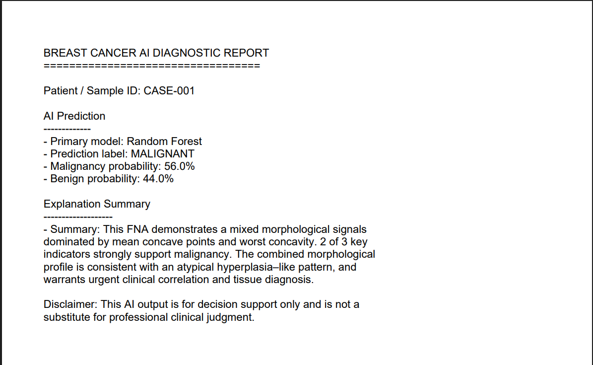
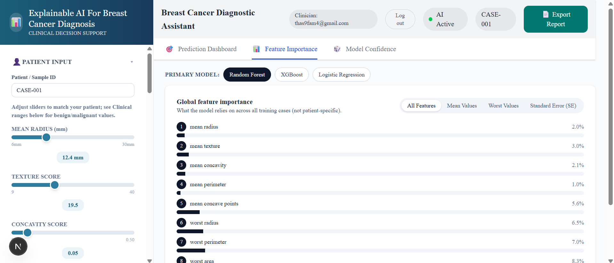
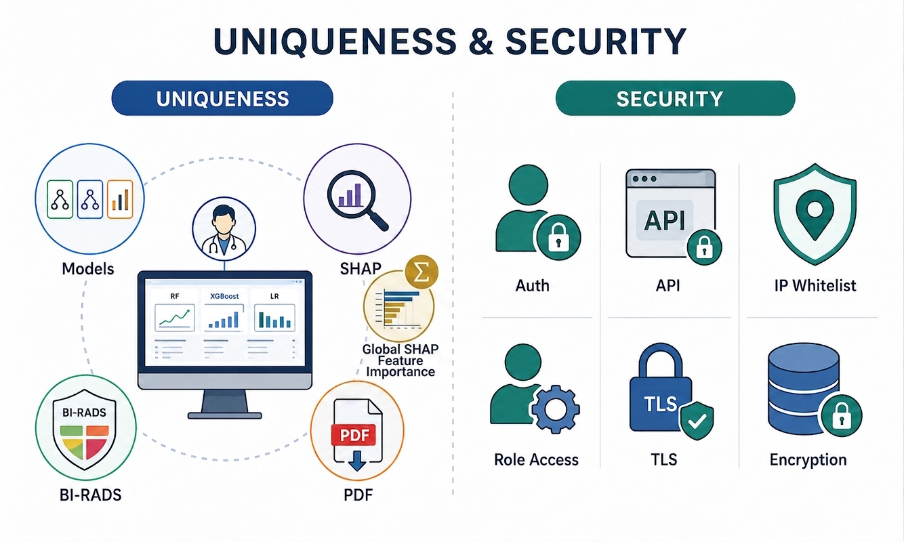

# 🧬 Explainable AI for Breast Cancer Diagnosis

  

  An explainable decision-support prototype: a system where clinicians can see predictions, understand why the model decided that way, compare multiple algorithms on the same patient, and export a structured report.

  
  
  
  

> 🔒 **Portfolio Project — All Rights Reserved**
>
> This repository is publicly available for demonstration and evaluation.
> Please do not reuse or redistribute the source code without permission.

## 🧠 The Problem

### Traditional ML

**Prediction**

`Patient Features → Model → Malignant`

But...

**Why?**

---

### Explainable AI

`Patient Features`
↓
`ML Model`
↓
`Prediction`
↓
`SHAP`
↓
`Feature Contributions`
↓
`Human-readable Explanation`

> ⚠️ **Important:** This is an academic proof-of-concept and is **not intended for clinical diagnosis or medical decision-making**.

---

## ⚡ Project at a Glance

| 🧠 Intelligence | 🔎 Explainability | ⚙️ Backend | 🎨 Interface | 🗄️ Data | 🐳 Infrastructure |
|---|---|---|---|---|---|
| XGBoost · RF · LR | SHAP · LIME | FastAPI · Python | Next.js · TypeScript | MongoDB Atlas | Docker |

---

## ✨ Features

- 🤖 **Machine Learning** — Random Forest, XGBoost & Logistic Regression
- 🔍 **Explainable AI** — Global & local SHAP explanations
- 📊 **Interactive Dashboard** — Predictions, probabilities & feature analysis
- 📈 **Model Evaluation** — Accuracy, Sensitivity, Specificity, AUC-ROC & Brier Score
- 📄 **Report Export** — Prediction, explanation & decision-support summary
- 🔐 **Authentication** — Protected routes with MongoDB Atlas

---

## 🏗️ System Architecture

~~~text
                    ┌──────────────────────────┐
                    │      Next.js Frontend    │
                    │     TypeScript / CSS     │
                    └────────────┬─────────────┘
                                 │
                              JSON API
                                 │
                                 ▼
                    ┌──────────────────────────┐
                    │      FastAPI Backend     │
                    │         Python           │
                    ├──────────────────────────┤
                    │ Prediction API           │
                    │ Model Selection          │
                    │ Preprocessing            │
                    │ SHAP Explanations        │
                    │ Summary Generation       │
                    └────────────┬─────────────┘
                                 │
              ┌──────────────────┼──────────────────┐
              │                  │                  │
              ▼                  ▼                  ▼
       Random Forest          XGBoost        Logistic Regression
              │                  │                  │
              └──────────────────┼──────────────────┘
                                 │
                                 ▼
                           SHAP Explainer
                                 │
                                 ▼
                    Feature Contributions
                                 │
                                 ▼
                    Human-readable Summary

                    ┌──────────────────────────┐
                    │      MongoDB Atlas       │
                    │ Authentication / Config  │
                    └──────────────────────────┘
~~~

---

## 🧰 Tech Stack

### Frontend

### Backend

### Machine Learning & XAI

### Database & Infrastructure

---

## 🏆 Model Performance

| Model | Accuracy | Sensitivity | Specificity | AUC |
|---|---:|---:|---:|---:|
| Random Forest | 94.74% | 95.83% | 92.86% | 0.992 |
| **XGBoost** | **97.37%** | **98.61%** | **95.24%** | **0.994** |
| Logistic Regression | 93.86% | 93.06% | 95.24% | 0.993 |

### 🥇 Best Test-Set Performance

**XGBoost**

`97.37% Accuracy` · `98.61% Sensitivity` · `0.994 AUC-ROC`

---

## 🔎 Explainability with SHAP

### Why did the model make this prediction?

  

The model doesn't simply return:

> **Malignant — 56.0%**

It also identifies the features contributing to that prediction.

| Feature | Influence |
|---|---|
| Mean Concave Points | ↑ Elevated influence |
| Worst Radius| ↓ Lower influence |
| Worst Concavity | ↑ Elevated influence |
| Worst Concave Points | ↓ Elevated influence |
| Worst Area | ↑ Elevated influence |

---

## 🔎 SHAP Explainability

SHAP is used at two levels.

### Global Explainability

Global SHAP analysis identifies the features that have the greatest influence across the test dataset.

Important feature groups include:

- Cell size
- Radius
- Perimeter
- Area
- Concavity
- Concave points
- Shape irregularity

### Local Explainability

For an individual case, SHAP identifies which features:

- Push the prediction towards **malignant**
- Push the prediction towards **benign**
- Contribute strongly to the prediction
- Create competing signals in borderline cases

This allows users to understand **why** a prediction was produced instead of seeing only a classification label.

---

## ✨ Feature Gallery

| Malignant/Benign Prediction | Explainability | Login/Signup | 
|---|---|---|
|  |  |  |

| Model Confidence | Export Diagnostic Reports | Feature Importance |
|---|---|---|
|  |  | |  |

---

## 🔄 Application Workflow

~~~text
User Login
     │
     ▼
Enter WDBC Feature Values
     │
     ▼
Select ML Model
     │
     ▼
Next.js sends JSON request
     │
     ▼
FastAPI Prediction Endpoint
     │
     ├── Preprocessing
     │
     ├── Model Prediction
     │
     └── SHAP Calculation
     │
     ▼
Prediction + Probabilities
     │
     ▼
SHAP Explanation
     │
     ├── Text Summary
     ├── Feature Influence
     └── Feature Impact
     │
     ▼
Model Confidence
     │
     ▼
Export Diagnosis Report
~~~

---

## ⚙️ Backend

The backend is implemented as a REST-style FastAPI service.

Core functionality includes:

~~~text
FastAPI
│
├── Request Validation
│   └── Pydantic
│
├── Model Loading
│   └── Joblib
│
├── Prediction
│   ├── Random Forest
│   ├── XGBoost
│   └── Logistic Regression
│
├── Explainability
│   └── SHAP
│
└── Explanation Summary
    └── summary_generator
~~~

The trained models and preprocessing components are loaded by the backend when the application starts.

---

## 📂 Project Structure

~~~text
explainable-ai-breast-cancer/
│
├── backend/
|   ├── _pycache_/
│   ├── main.py
│   ├── summary_generator.py
│   ├── requirements.txt
│   ├── models.pkl
│   ├── preprocessing.npy
│   └── Dockerfile
│
├── frontend/
|   ├── .next/
│   ├── app/
│   ├── components/
|   ├── lib/
|   ├── node_modules/
│   ├── public/
|   ├── .env.local
|   ├── .gitignore
|   ├── components.json
|   ├── eslint.config.mjs
|   ├── next-env.d.ts
|   ├── next.config.ts
|   ├── package-lock.json
│   ├── package.json
|   ├── postcss.config.mjs
|   ├── README.md
│   └── tsconfig.json
│
├── docker-compose.yml
│
└── README.md
~~~

---

## 🔒 Design Approach and Security

Designed to go beyond a conventional ML classification system and incorporated security measures using MongoDB Atlas.

  

The application is currently intended for a controlled local development environment rather than a live internet-facing clinical service.

---

## ⚠️ Limitations

This project is a **prototype**, not a clinically validated diagnostic system.

Key limitations include:

- Based on a single benchmark dataset
- Does not process raw medical images
- Uses FNA-derived tabular features
- Does not include additional clinical variables
- No external clinical validation
- No formal clinician usability study
- Not integrated with hospital information systems
- Not deployed as a live clinical service

---

## 🔮 Future Improvements

Potential future improvements include:

- 🔬 Additional clinical and imaging features
- 🔄 Automated model retraining
- 📦 Model versioning and model registry
- 🧪 Development, staging and production deployment
- 🔐 Role-based access control
- 👩‍⚕️ Formal clinician usability studies
- 🔎 Similar-case retrieval
- 🎯 What-if analysis
- 👥 Role-specific interfaces
- 📊 Additional explainability techniques

---

## 🎓 Academic Project

**Project:** Explainable AI for Breast Cancer Diagnosis  
**Student:** Thaspeeha Vahithu  
**Programme:** BSc (Hons) Computer Science  
**University:** University of West London – RAK Branch

---

## 🎯 What I Built

- 🧠 ML model training & evaluation
- 🔎 SHAP-based explainability
- ⚙️ FastAPI REST API
- 🎨 Next.js dashboard
- 🗄️ MongoDB authentication
- 🐳 Docker containerization
- 📄 Automated report generation

---

## 📚 Project Resources

🎥 [**Demo Video**](https://youtu.be/Y90TX0RYJr4)

🖼️ [**Project Poster**](my-frontend/public/poster.png)

📄 [**Read Project Documentation**](my-frontend/public/Project_Report.pdf)

---

## 📜 Disclaimer

This software is an **academic proof-of-concept** developed for educational and research purposes.

It has not undergone clinical validation, regulatory approval, or formal clinician usability evaluation.

**The predictions and explanations generated by this application must not be used as a substitute for professional medical diagnosis or clinical judgement.**

---

## 🔒 Copyright & Usage

© 2026 Thaspeeha Vahithu. All Rights Reserved.

This repository is provided for **portfolio and demonstration purposes**.

The source code, application design, UI/UX, documentation, machine-learning implementation, and other original materials in this repository are my own work.

You may **view and clone this repository for personal evaluation, learning, and portfolio review**.

However, without prior written permission, you may not:

- Reuse the source code in another project
- Redistribute or republish the code
- Present the project or its implementation as your own
- Use the project commercially
- Copy substantial portions of the implementation

If you would like to use or adapt any part of this project, please contact me first.

  ──────────────── ✦ ────────────────

