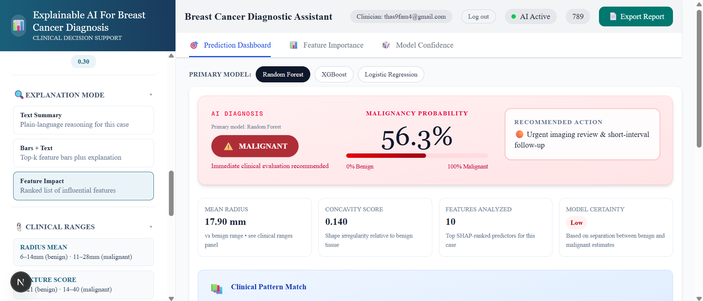

# 🧬 Explainable AI for Breast Cancer Diagnosis

  <svg width="850" height="100" viewBox="0 0 850 100" xmlns="http://www.w3.org/2000/svg">
    <defs>
      <filter id="glow">
        <feGaussianBlur stdDeviation="4" result="blur"/>
        <feMerge>
          <feMergeNode in="blur"/>
          <feMergeNode in="SourceGraphic"/>
        </feMerge>
      </filter>
    </defs>

    <image
      href="https://readme-typing-svg.demolab.com?font=Fira+Code&size=22&duration=2500&pause=800&color=00D9FF&center=true&vCenter=true&width=850&lines=Machine+Learning+%C3%97+Explainable+AI+%C3%97+Fullstack+Development;SHAP+%C3%97+FastAPI+%C3%97+Next.js;Predict.+Explain.+Understand.;Building+Transparent+AI+Systems."
      width="850"
      height="100"
      filter="url(%23glow)"
    />
  </svg>

  An interactive decision-support prototype that combines ML predictions with human-readable SHAP explanations.

## ✨ What is this?

Machine-learning models can make highly accurate predictions, but understanding **why** a model made a particular prediction can be difficult.

This project explores **Explainable AI (XAI)** by combining machine learning with SHAP-based explanations to provide both:

> **A prediction + an explanation of the prediction**

The application classifies breast tumour cases as **benign or malignant** using the Breast Cancer Wisconsin Diagnostic (WDBC) dataset and provides interactive visual explanations of the model's decision.

> ⚠️ **Important:** This is an academic proof-of-concept and is **not intended for clinical diagnosis or medical decision-making**.

---

## ⚡ Project at a Glance

| | |
|---|---|
| 🧠 **Models** | Random Forest · XGBoost · Logistic Regression |
| 🔎 **XAI** | SHAP · LIME |
| 🎨 **Frontend** | Next.js · TypeScript |
| ⚙️ **Backend** | FastAPI · Python |
| 🗄️ **Database** | MongoDB Atlas |
| 🐳 **Deployment** | Docker |
| 📊 **Dataset** | WDBC |
| 📄 **Output** | Prediction + Explanation + Report |

---

## ✨ Features

### 🤖 Machine Learning

- Breast tumour classification
- Benign vs malignant prediction
- Random Forest
- XGBoost
- Logistic Regression
- Model comparison
- Multiple evaluation metrics
- Serialized models loaded through the FastAPI backend

### 🔍 Explainable AI

The application uses **SHAP (SHapley Additive exPlanations)** to explain model predictions.

It provides:

- Global feature importance
- Local/case-level explanations
- Feature contribution values
- Prediction-driving features
- Malignancy vs benignity contribution direction
- Human-readable explanation summaries

### 📊 Prediction Dashboard

The frontend provides:

- Feature input controls
- Prediction results
- Malignancy probability
- Benign probability
- Multiple explanation modes
- Feature importance analysis
- Model confidence analysis
- Model comparison
- Report export

### 📈 Model Confidence

The Model Confidence section provides:

- Accuracy
- Sensitivity
- Specificity
- AUC-ROC
- Brier Score
- False Negative Rate
- Confusion matrices
- Model agreement/disagreement

### 📄 Report Export

Users can generate a structured diagnosis report containing:

- Primary model
- Predicted classification
- Malignancy probability
- Benign probability
- Generated explanation summary
- Decision-support disclaimer

### 🔐 Authentication

The application includes:

- User signup
- User login
- Protected dashboard routes
- MongoDB Atlas authentication storage
- IP access restrictions
- TLS-secured database connections

---

## 🏗️ System Architecture

~~~text
                    ┌──────────────────────────┐
                    │      Next.js Frontend    │
                    │     TypeScript / CSS     │
                    └────────────┬─────────────┘
                                 │
                              JSON API
                                 │
                                 ▼
                    ┌──────────────────────────┐
                    │      FastAPI Backend     │
                    │         Python           │
                    ├──────────────────────────┤
                    │ Prediction API            │
                    │ Model Selection           │
                    │ Preprocessing             │
                    │ SHAP Explanations        │
                    │ Summary Generation        │
                    └────────────┬─────────────┘
                                 │
              ┌──────────────────┼──────────────────┐
              │                  │                  │
              ▼                  ▼                  ▼
       Random Forest          XGBoost        Logistic Regression
              │                  │                  │
              └──────────────────┼──────────────────┘
                                 │
                                 ▼
                           SHAP Explainer
                                 │
                                 ▼
                    Feature Contributions
                                 │
                                 ▼
                    Human-readable Summary

                    ┌──────────────────────────┐
                    │      MongoDB Atlas       │
                    │ Authentication / Config  │
                    └──────────────────────────┘
~~~

---

## 🧰 Tech Stack

### Frontend

### Backend

### Machine Learning & XAI

### Database & Infrastructure

---

## 🧠 Machine Learning Models

Three supervised learning models were trained and evaluated:

| Model | Accuracy | Sensitivity | Specificity | AUC-ROC | Brier Score | FNR |
|---|---:|---:|---:|---:|---:|---:|
| Random Forest | 94.74% | 95.83% | 92.86% | 0.992 | 0.0324 | 4.17% |
| **XGBoost** | **97.37%** | **98.61%** | **95.24%** | **0.994** | **0.0275** | **1.39%** |
| Logistic Regression | 93.86% | 93.06% | 95.24% | 0.993 | 0.0385 | 6.94% |

### 🏆 Best Performing Model

**XGBoost** achieved the strongest overall performance in the project's test-set evaluation:

- Accuracy: **97.37%**
- Sensitivity: **98.61%**
- Specificity: **95.24%**
- AUC-ROC: **0.994**
- Brier Score: **0.0275**
- False Negative Rate: **1.39%**

---

## 🔍 Why Explainable AI?

Traditional ML:

> **Prediction → Malignant**

Explainable AI:

> **Prediction → Malignant**
>
> ↳ Radius increased the prediction  
> ↳ Concavity increased the prediction  
> ↳ Perimeter increased the prediction  
> ↳ Texture contributed less

### The goal

**Don't just predict. Explain.**

---

## 🔎 SHAP Explainability

SHAP is used at two levels.

### Global Explainability

Global SHAP analysis identifies the features that have the greatest influence across the test dataset.

Important feature groups include:

- Cell size
- Radius
- Perimeter
- Area
- Concavity
- Concave points
- Shape irregularity

### Local Explainability

For an individual case, SHAP identifies which features:

- Push the prediction towards **malignant**
- Push the prediction towards **benign**
- Contribute strongly to the prediction
- Create competing signals in borderline cases

This allows users to understand **why** a prediction was produced instead of seeing only a classification label.

---

## 📊 Dashboard Sections

~~~text
Dashboard
│
├── Prediction
│   ├── Feature Inputs
│   ├── Model Selection
│   ├── Diagnosis
│   └── Probability
│
├── SHAP Explanations
│   ├── Clinical Reasoning
│   ├── Feature Influence
│   └── Feature Impact
│
├── Feature Importance
│   └── Global SHAP Analysis
│
├── Model Confidence
│   ├── Performance Metrics
│   ├── Confusion Matrices
│   └── Model Agreement
│
└── Report Export
    └── Diagnostic PDF
~~~

---

## ✨ Feature Gallery

| Prediction | Explainability |
|---|---|
|  |  |

| Model Confidence | Report |
|---|---|
|  |  |

---

## 🔄 Application Workflow

~~~text
User Login
     │
     ▼
Enter WDBC Feature Values
     │
     ▼
Select ML Model
     │
     ▼
Next.js sends JSON request
     │
     ▼
FastAPI Prediction Endpoint
     │
     ├── Preprocessing
     │
     ├── Model Prediction
     │
     └── SHAP Calculation
     │
     ▼
Prediction + Probabilities
     │
     ▼
SHAP Explanation
     │
     ├── Text Summary
     ├── Feature Influence
     └── Feature Impact
     │
     ▼
Model Confidence
     │
     ▼
Export Diagnosis Report
~~~

---

## ⚙️ Backend

The backend is implemented as a REST-style FastAPI service.

Core functionality includes:

~~~text
FastAPI
│
├── Request Validation
│   └── Pydantic
│
├── Model Loading
│   └── Joblib
│
├── Prediction
│   ├── Random Forest
│   ├── XGBoost
│   └── Logistic Regression
│
├── Explainability
│   └── SHAP
│
└── Explanation Summary
    └── summary_generator
~~~

The trained models and preprocessing components are loaded by the backend when the application starts.

---

## 📂 Project Structure

~~~text
explainable-ai-breast-cancer/
│
├── backend/
│   ├── main.py
│   ├── summary_generator.py
│   ├── requirements.txt
│   ├── models/
│   ├── preprocessing/
│   └── Dockerfile
│
├── frontend/
│   ├── app/
│   ├── components/
│   ├── public/
│   ├── package.json
│   └── tsconfig.json
│
├── notebooks/
│   └── model_training.ipynb
│
├── reports/
│
└── README.md
~~~

> Adjust this structure to match your actual repository.

---

## 🔒 Security

MongoDB Atlas was configured using security measures including:

- Project-specific database user
- Limited database privileges
- IP access list
- TLS encryption in transit
- Encryption at rest

The application is currently intended for a controlled local development environment rather than a live internet-facing clinical service.

---

## ⚠️ Limitations

This project is a **prototype**, not a clinically validated diagnostic system.

Key limitations include:

- Based on a single benchmark dataset
- Does not process raw medical images
- Uses FNA-derived tabular features
- Does not include additional clinical variables
- No external clinical validation
- No formal clinician usability study
- Not integrated with hospital information systems
- Not deployed as a live clinical service

---

## 🔮 Future Improvements

Potential future improvements include:

- 🔬 Additional clinical and imaging features
- 🔄 Automated model retraining
- 📦 Model versioning and model registry
- 🧪 Development, staging and production deployment
- 🔐 Role-based access control
- 👩‍⚕️ Formal clinician usability studies
- 🔎 Similar-case retrieval
- 🎯 What-if analysis
- 👥 Role-specific interfaces
- 📊 Additional explainability techniques

---

## 🎓 Academic Project

**Project:** Explainable AI for Breast Cancer Diagnosis  
**Student:** Thaspeeha Vahithu  
**Programme:** BSc (Hons) Computer Science  
**University:** University of West London – RAK Branch

---

## 🛠️ Skills Demonstrated

~~~text
Python
FastAPI
REST APIs
Next.js
TypeScript
Machine Learning
Scikit-learn
XGBoost
Random Forest
Logistic Regression
SHAP
LIME
Pandas
NumPy
MongoDB Atlas
Docker
Git & GitHub
Explainable AI
Data Analysis
Model Evaluation
Full-Stack Development
~~~

---

## 🎯 What This Project Demonstrates

- 🧠 Building and evaluating machine-learning models
- 🔎 Making ML predictions interpretable using SHAP
- ⚙️ Designing REST APIs with FastAPI
- 🎨 Building interactive dashboards with Next.js
- 🗄️ Integrating MongoDB Atlas
- 🐳 Containerising applications with Docker
- 📊 Communicating model performance visually

---

## 📜 Disclaimer

This software is an **academic proof-of-concept** developed for educational and research purposes.

It has not undergone clinical validation, regulatory approval, or formal clinician usability evaluation.

**The predictions and explanations generated by this application must not be used as a substitute for professional medical diagnosis or clinical judgement.**

---

## ⭐ Project Highlights

**Machine Learning + Explainable AI + Full-Stack Engineering**

This project demonstrates the integration of:

~~~text
Machine Learning
       ↓
FastAPI Backend
       ↓
SHAP Explainability
       ↓
Next.js Dashboard
       ↓
MongoDB Atlas
       ↓
Report Export
~~~

The result is an interactive decision-support prototype that combines **prediction, explainability, model comparison, authentication and report generation** in a single full-stack application.

